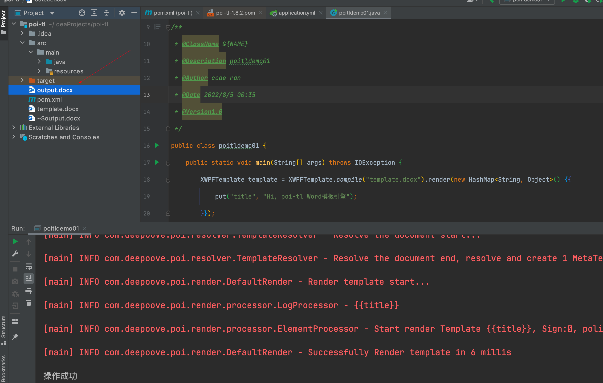

##                                              POI-TL

### 1、概述：

​       poi-tl（poi template language）是Word模板引擎，基于Microsoft Word模板和数据生成新的文档。他是基于Apache poi 的。Apache POI不仅在上层封装了易用的文档API(文本、图片、表格、页眉、页脚、图表等)，也可以在底层直接操作文档XML结构，**poi-tl**正是一个基于Apache POI的Word模板引擎，并且拥有着让人喜悦的特性。

官网：http://deepoove.com/poi-tl/1.10.x/#_template%E6%A8%A1%E6%9D%BF

​           https://github.com/Sayi/poi-tl


2、环境：

- Apache POI 4.1.2+
- JDK 1.8+
- Poi-tl 1.8.2  基于Apache POI 4.1.2+的API封装

3、依赖：

```xml
    <dependency>
      <groupId>com.deepoove</groupId>
      <artifactId>poi-tl</artifactId>
      <version>1.10.0</version>
    </dependency>
```


当我们引入poi-tl的时候，他会默认把apache poi的相关jar包也一起加入进来，而且还有commons-lang3的依赖包。

4、创建一个空白文档，编写相关模板信息：
  （1）文档：template.docx

5、编写代码：

```java
        XWPFTemplate template = XWPFTemplate.compile("poi-tl/template.docx").render(new HashMap<String, Object>() {{
            put("title", "Hi, poi-tl Word模板引擎");
        }});
        template.writeAndClose(new FileOutputStream("output.docx"));
        System.out.println("操作成功");
```

但是运行后报错了：

```xml
SLF4J: Failed to load class "org.slf4j.impl.StaticLoggerBinder".
SLF4J: Defaulting to no-operation (NOP) logger implementation
SLF4J: See http://www.slf4j.org/codes.html#StaticLoggerBinder for further details.
操作成功
```

错误原因是少了slf4j-nop.jar slf4j-simple.jar， slf4j-log4j12.jar，slf4j-jdk14.jar或 logback-classic.jar中的其中一个jar包，加上去就行（只能是一个，多了就会有冲突）

解决方法：

https://blog.csdn.net/weixin_47872288/article/details/122358131

添加依赖：

```xml
<dependency>
　　<groupId>org.slf4j</groupId>
　　<artifactId>slf4j-simple</artifactId>
　　<version>1.7.25</version>
　　<scope>compile</scope>
</dependency>
```

重新运行后结果：




6、上述代码工作流程：

​       编译模板  ----  渲染数据  ----- 输出到流

7、Template

```
模板就要所见即所得。模板是Docx格式的Word文档，你可以使用Microsoft office、WPS Office、Pages等任何你喜欢的软件制作模板。所有的标签都是以 {{ 开头，以 }} 结尾，模板标签可以出现在任何位置，包括页眉，页脚，表格内部，文本框等等。poi-tl遵循“所见即所得”的设计，模板的样式会被完全保留，标签的样式也会应用在替换后的文本上。
```

8、数据模型：

​    数据类似于哈希或者字典，可以是Map结构（其中key 是标签名称）

```java
Map<String, Object> data = new HashMap<>();
data.put("name", "Sayi");
data.put("start_time", "2019-08-04");
```

也可以是对象（属性名是标签名称）：

数据可以是树结构，每级之间用点来分隔开，比如`{{author.name}}`标签对应的数据是author对象的name属性值。

```java
public class Data {
  private String name;
  private String startTime;
  private Author author;
}
```

9、output 输出：

以流的方式进行输出：

```java
template.write(OutputStream stream);
```

可以写到任意输出流中，比如文件流：

```
template.write(new FileOutputStream("output.docx"));
```

又比如说网络流：

```java
response.setContentType("application/octet-stream");
response.setHeader("Content-disposition","attachment;filename=\""+"out_template.docx"+"\"");

// HttpServletResponse response
OutputStream out = response.getOutputStream();
BufferedOutputStream bos = new BufferedOutputStream(out);
template.write(bos);
bos.flush();
out.flush();
PoitlIOUtils.closeQuietlyMulti(template, bos, out);
```


注意在做完逻辑之后，记得关闭自己创建的流；


### 2、标签

​        poi-tl是一种无逻辑「logic-less」的模板引擎，没有复杂的控制结构和变量赋值，只有标签。标签由前后两个大括号组成，{{title}}是标签，{{?title}}也是标签，title是这个标签的名称，问号标识了标签类型，接下来我们来看看有哪些默认标签类型（用户可以创建新的标签类型，这属于更高级的话题）

2.1 文本：

```
{{var}}
```

数据模型：

- `String` ：文本
- `TextRenderData` ：有样式的文本
- `HyperlinkTextRenderData` ：超链接和锚点文本
- `Object` ：调用 toString() 方法转化为文本

```java
put("name", "Sayi");
put("author", new TextRenderData("000000", "Sayi"));
put("link", new HyperlinkTextRenderData("website", "http://deepoove.com"));
put("anchor", new HyperlinkTextRenderData("anchortxt", "anchor:appendix1"));
```


除了new操作符，还提供了更加优雅的工厂 `Texts` 和链式调用的方式轻松构建文本模型。

```java
put("author", Texts.of("Sayi").color("000000").create());
put("link", Texts.of("website").link("http://deepoove.com").create());
put("anchor", Texts.of("anchortxt").anchor("appendix1").create());
```

所见即所得，标签的样式会应用到替换后的文本上，也可以通过代码设定文本的样式。

TextRenderData的结构体

```json
{
  "text": "Sayi",
  "style": {
    "strike": false, 
    "bold": true, 
    "italic": false, 
    "color": "00FF00", 
    "underLine": false, 
    "fontFamily": "微软雅黑", 
    "fontSize": 12, 
    "highlightColor": "green", 
    "vertAlign": "superscript", 
    "characterSpacing" : 20 
  }
}
```

|      | 删除线       |
| ---- | ------------ |
|      | 粗体         |
|      | 斜体         |
|      | 颜色         |
|      | 下划线       |
|      | 字体         |
|      | 字号         |
|      | 背景高亮色   |
|      | 上标或者下标 |
|      | 间距         |

文本换行使用 `\n` 字符。


2.2 图片:

 图片标签以@开始：{{@var}}


数据模型：

- `String` ：图片url或者本地路径，默认使用图片自身尺寸
- `PictureRenderData`
- `ByteArrayPictureRenderData`
- `FilePictureRenderData`
- `UrlPictureRenderData`

推荐使用工厂 `Pictures` 构建图片模型。

代码示例

```java
// 指定图片路径
put("image", "logo.png");
// svg图片
put("svg", "https://img.shields.io/badge/jdk-1.6%2B-orange.svg");

// 设置图片宽高
put("image1", Pictures.ofLocal("logo.png").size(120, 120).create());

// 图片流
put("streamImg", Pictures.ofStream(new FileInputStream("logo.jpeg"), PictureType.JPEG)
  .size(100, 120).create());

// 网络图片(注意网络耗时对系统可能的性能影响)
put("urlImg", Pictures.ofUrl("http://deepoove.com/images/icecream.png")
  .size(100, 100).create());

// java图片
put("buffered", Pictures.ofBufferedImage(bufferImage, PictureType.PNG)
  .size(100, 100).create());
```

图片支持BufferedImage，这意味着我们可以利用Java生成图表插入到word文档中。

FilePictureRenderData的结构体:

```json
{
  "pictureType" : "PNG", 
  "path": "logo.png", 
  "pictureStyle": {
    "width": 100, 
    "height": 100 
  },
  "altMeta": "图片不存在" 
}
```

|      | 图片类型                   |
| ---- | -------------------------- |
|      | 图片路径                   |
|      | 宽度，单位是像素           |
|      | 高度，单位是像素           |
|      | 当无法获取图片时展示的文字 |


2.3 表格:


表格标签以#开始：{{#var}}

数据模型：

- `TableRenderData`

推荐使用工厂 `Tables` 、 `Rows` 和 `Cells` 构建表格模型。

Example 1. 基础表格示例

```java
// 一个2行2列的表格
put("table0", Tables.of(new String[][] {
                new String[] { "00", "01" },
                new String[] { "10", "11" }
            }).border(BorderStyle.DEFAULT).create());
```


Example 2. 表格样式示例

```java
// 第0行居中且背景为蓝色的表格
RowRenderData row0 = Rows.of("姓名", "学历").textColor("FFFFFF")
      .bgColor("4472C4").center().create();
RowRenderData row1 = Rows.create("李四", "博士");
put("table1", Tables.create(row0, row1));
```


Example 3. 表格合并示例

```java
// 合并第1行所有单元格的表格
RowRenderData row0 = Rows.of("列0", "列1", "列2").center().bgColor("4472C4").create();
RowRenderData row1 = Rows.create("没有数据", null, null);
MergeCellRule rule = MergeCellRule.builder().map(Grid.of(1, 0), Grid.of(1, 2)).build();
put("table3", Tables.of(row0, row1).mergeRule(rule).create());
```


TableRenderData表格模型在单元格内可以展示文本和图片，同时也可以指定表格样式、行样式和单元格样式，而且在N行N列渲染完成后可以应用单元格合并规则 **MergeCellRule** ，从而实现更复杂的表格。

TableRenderData的结构体

```json
{
  "rows": [ 
    {
      "cells": [ 
        {
          "paragraphs": [ 
            {
              "contents": [
                {
                  [TextRenderData] 
                },
                {
                  [PictureRenderData] 
                }
              ],
              "paragraphStyle": null 
            }
          ],
          "cellStyle": { 
            "backgroundColor": "00000",
            "vertAlign": "CENTER"
          }
        }
      ],
      "rowStyle": { 
        "height": 2.0f
      }
    }
  ],
  "tableStyle": { 
    "width": 14.63f, 
    "colWidths": null
  },
  "mergeRule": { 
    "mapping": {
      "0-0": "1-2"
    }
  }
}
```

|      | 行数据                                                       |
| ---- | ------------------------------------------------------------ |
|      | 单元格数据                                                   |
|      | 单元格内段落                                                 |
|      | 单元格内文本                                                 |
|      | 单元格内图片                                                 |
|      | 单元格内段落文本的样式：对齐                                 |
|      | 单元格样式：垂直对齐方式，背景色                             |
|      | 行样式：行高(单位cm)                                         |
|      | 表格样式：表格对齐、边框样式                                 |
|      | 表格宽度(单位cm)，表格的最大宽度 = 页面宽度 - 页边距宽度 * 2，页面宽度为A4(20.99 * 29.6，页边距为3.18 * 2.54)的文档最大表格宽度14.63cm。 |
|      | 单元格合并规则，比如第0行第0列至第1行第2列单元格合并         |
