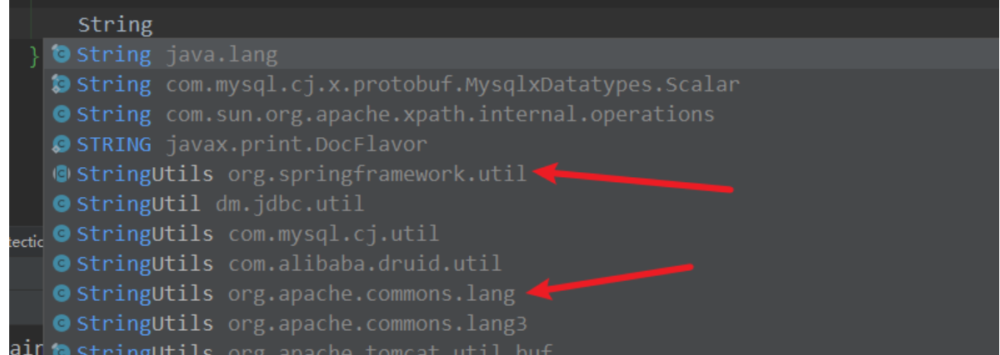
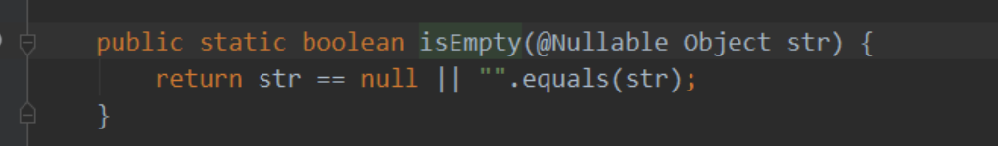

####                                            java中对字符串进行判空操作


##### 方法一: 最多人使用的一个方法, 但效率很低:

```java
if(s == null || s.equals(""));
```

##### 方法二: 比较字符串长度, 效率高：

```java
if(s == null || s.length() == 0);
```

##### 方法三: Java SE 6.0 才开始提供的方法, 效率和方法二几乎相等, 但出于兼容性考虑, 推荐使用方法二.

```java
if(s == null || s.isEmpty());
```

##### 方法四: 这是一种比较直观,简便的方法,而且效率也非常的高,与方法二、三的效率差不多:

```java
if (s == null || s == "");
```

使用equal（）方法需要先进行判断目标比对对象的类型，然后再进行其它操作，同时还要遍历String对象的每一个char，查看是否相同，而length（）直接返回String对象的Count属性，效率更高。

##### 推荐使用

```java
if(null == s || s.length()==0)
//或者
if(null == s || "".equals(s))
```

这种写法，像s.equals("")这种判断的话如果s为null就会出现空指针异常，但是改成"".equals(s)这种写法的话，则即使s为null也不会有问题。

##### 如果将判断写成if(s=null),在不少语言里这是可以编译运行的，并且得不到你希望的结果。所以在Java中进行比较就最好把常量放在左边。


spring框架自带的StringUtils也可以对字符串对象进行判空操作：



