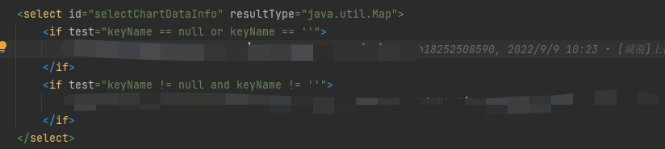

##                                springboot+mybatis---全动态插入

#### 场景一:

1、当后端查询的字段数量不确定时，即所查询的字段是来自某个表的某个字段相应的值时。这时我们就无法通过构造实体的方式，接收数据库查出的每个字段对应的数据。这时候我们可以使用:

```java
List<Map<String,Object>>
```

这样的数据结构去接收后端查询出的数据。

 Map<String,Object>中对应的键是：查出的对应字段，value值对应的是查出的每个字段对应的数据；


这时候在mapper接口中需要使用@MapKey("id")注解去设定对应的键，最好是主键，resultType返回的是:一个Map;

值得注意的是，通过**@MapKey**注解返回的Map，其key的类型和指定的字段类型是一致的。

例如：指定id作为Map的key,id为int类型，那么该Map的key也为integer类型，如果你通过String类型的key去获取value，则获取不到。

```java
    @MapKey("id")
    List<Map<String, Object>> selectChartDataInfo(String keyName, Integer Id);
```




#### 场景二：

前端传的参数不确定，字段会有多种情况出现时。也无法定义一个实体接收前端传递的参数；这个时候可以使用List<String,Object>这样的数据结构去接收前端传递的参数

比如接收前端的参数集合，对数据进行插入：这个时候在Mapper的interface里需要传的是一个Map<String,Object>

```java
void insertChartDDataInfoByMap(@Param("dataMap") Map<String, Object> dataMap);
```

```xml
    <insert id="insertChartDDataInfoByMap" parameterType="java.util.Map">
        INSERT tablexxx (
        <foreach collection="dataMap" item="value" index="key" separator=",">
            ${key}
        </foreach>
        )
        values (
        <foreach collection="dataMap" item="value" index="key" open="'" separator="','" close="'">
            ${value}
        </foreach>
        )
    </insert>
```

得加上open和separator,close也就是在插入的每个数据加单引号，防止程序出错。


mybatis使用Map<String,Object>映射，会将tinyint映射成Integer类型、decimal映射成BigDecimal类型

所以程序在处理这些字段时，需要做个强转操作.