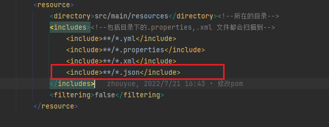

####                                                                                    springboot读取项目下的文件

1、方式一：

```java
        File jsonFile = ResourceUtils.getFile("classpath:static/data.json");
        //数据读取
        String json = FileUtils.readFileToString(jsonFile);
```

方式二
新建一个 Service 类 JsonUtilService

```java
@Service
public class JsonUtilService {
@Value("classpath:static/data.json")
public Resource resource;
 
public String getData(){
    try {
        File file = resource.getFile();
        String jsonData = this.jsonRead(file);
        return jsonData;
    } catch (Exception e) {
        return null;
    }
}
```

 

    private String jsonRead(File file) throws IOException{
        BufferedReader reader = null;
        StringBuilder buffer = new StringBuilder();
        reader = new BufferedReader(new FileReader(file));
        String line = "";
        while ((line = reader.readLine()) != null){
            buffer.append(line);
        }
        reader.close();
        return buffer.toString();
    }
}
然后注入到测试类中。

```java
@SpringBootTest
class SpringbootStudy05ApplicationTests {
@Autowired
JsonUtilService service;
 
@Autowired
ProductMapper mapper;
 
@Test
void getData() throws IOException {
    String value = service.getData();
    JSONArray jsonArray = JSONObject.parseArray(value);
 
    for (Object obj : jsonArray) {
        JSONObject jobj = (JSONObject) obj;
        int productId = Integer.parseInt(jobj.getString("ProductID"));
        String productName = jobj.getString("ProductName");
        String discontinued = jobj.getString("Discontinued");
        double unitPrice = Double.parseDouble(jobj.getString("UnitPrice"));
        int unitsInStock = Integer.parseInt(jobj.getString("UnitsInStock"));
 
        Product product = new Product();
        product.setProductId(productId);
        product.setProductName(productName);
        product.setDiscontinued(discontinued);
        product.setUnitPrice(unitPrice);
        product.setUnitsInStock(unitsInStock);
 
        mapper.save(product);
    }
  }
}  
```
总结
注意：这两种方式打成jar包很有可能读取不到数据。解决方案：修改 Json 文件的读取方式，代码如下：

```java
    public String getMockData() throws Exception {
        try {
        ClassPathResource classPathResource = new ClassPathResource("static/mockdata.json");
        InputStream in = classPathResource.getInputStream();
        InputStreamReader inputStreamReader = new InputStreamReader(in);
        BufferedReader br = new BufferedReader(inputStreamReader);
        String readLine = null;
        StringBuilder sb = new StringBuilder();
        while ((readLine = br.readLine()) != null) {
        if (readLine.charAt(0) == '-') {
        continue;
        } else {
        sb.append(readLine);
        sb.append('\r');
        }
        }
        br.close();
        String ret = sb.toString();
//            return ret;
        JSONObject jsonObject = JSON.parseObject(ret);
        JSONArray jsonArray = jsonObject.getJSONArray("result");
        String result = JSONArray.toJSONString(jsonArray);
        return result;
        } catch (IOException e) {
        throw new Exception("数据读取错误");
        } catch (NullPointerException e) {
        throw new Exception("输入流为空");
        }
        }
```
注意，如果使用了maven，那么需要在build下，resources里面添加包含文件，不然还是读取到这个路径下的文件。
